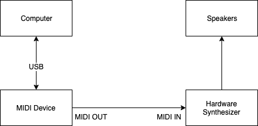

# MIDI CC Randomizer

This repository contains **Python** implementation of MIDI CC Randomizer and multiple JSON mappings for hardware synthesizers.
The script provides the functionality to generate random MIDI control messages (CC) based on the mapping file.
It allows you to randomly change parameters on the MIDI device and get the absolutely new sound every time.

## Requirements
* [Python 3](https://www.python.org/downloads/release/python-382/)
* Connected device with at least one MIDI output
* Hardware synthesizer

## Connectivity



## Install and execute
```bash
git clone https://github.com/oroskodias/midi-cc-randomizer.git
cd midi-cc-randomizer
pip3 install -r requirements.txt
python3 generate.py <mapping-file.json> 
```

## Mapping file
The mapping file is JSON file containing the codes of CC.
Based on this file the script can send randomized messages to the specific controllable parameters.

If you wish to use randomizer with your synthesizer and you can't find the mapping in this repository then you have 
to create the mapping file on your own.

Google something like `microkorg midi implementation`.

The search will bring you to this [file](https://cdn.korg.com/us/support/download/files/8f226053113b3be59753dcce14e74cca.pdf).
On page 62, you will find a table. You will need `Synth Parameter` , `Initial` and `Value`.
Then you have to create a mapping file based on `mapping-example.json` in the project.

#### Available types for mapping:

* `bool` - use it if parameter is on/off. You don't have to specify any values in the node "list" for this type;
* `list` - list of the values. It could be used for octaves and center-based parameters. Range - from 0 to 127. You have to add node "list" and specify a list of values there;
* `int` - range from 0 to 127. You don't have to specify any values in the column "list" for this type.

## Contribution

Please make pull requests to the develop branch.

## Help
If you need any help with mapping - create an issue in the repository and I will get back to you.
